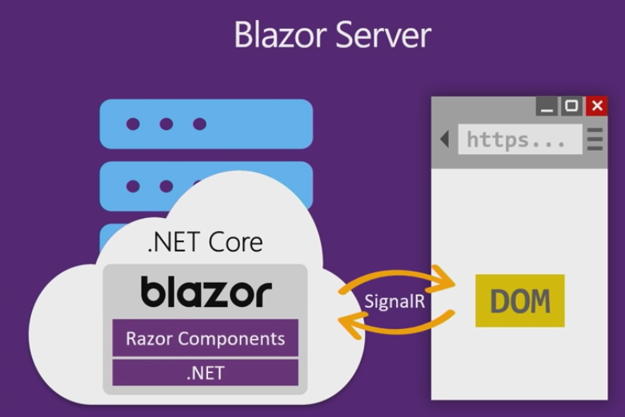
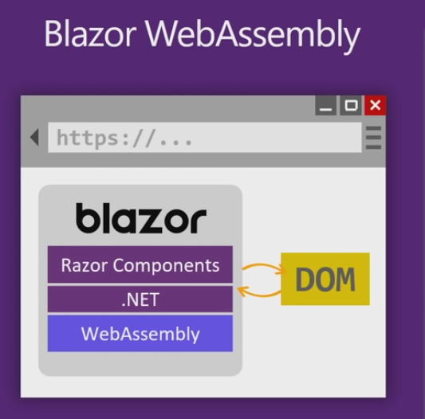

.. Blazor Boilerplate documentation master file, created by
   sphinx-quickstart on Sat Jun 27 21:15:54 2020.
   You can adapt this file completely to your liking, but it should at least
   contain the root `toctree` directive.

Documentation
=============

Blazor Boilerplate is a starter template for `Blazor web apps <https://dotnet.microsoft.com/apps/aspnet/web-apps/blazor>`_.

With Blazor Boilerplate you can easily switch between the two modes of Blazor.

From Microsoft documentation `ASP.NET Core Blazor hosting models <https://docs.microsoft.com/en-us/aspnet/core/blazor/hosting-models>`_.

Blazor Server
------------------

Pros
^^^^

* Download size is significantly smaller than a Blazor WebAssembly app, and the app loads much faster.
* The app takes full advantage of server capabilities, including use of any .NET Core compatible APIs.
* .NET Core on the server is used to run the app, so existing .NET tooling, such as debugging, works as expected.
* Thin clients are supported. For example, Blazor Server apps work with browsers that don't support WebAssembly and on resource-constrained devices.
* The app's .NET/C# code base, including the app's component code, isn't served to clients.

Cons
^^^^

* Higher latency usually exists. Every user interaction involves a network hop.
* There's no offline support. If the client connection fails, the app stops working.
* Scalability is challenging for apps with many users. The server must manage multiple client connections and handle client state.
* An ASP.NET Core server is required to serve the app. Serverless deployment scenarios aren't possible (for example, serving the app from a CDN).

Blazor WebAssembly
------------------

Pros
^^^^

* There's no .NET server-side dependency. The app is fully functioning after it's downloaded to the client.
* Client resources and capabilities are fully leveraged.
* Work is offloaded from the server to the client.
* An ASP.NET Core web server isn't required to host the app. Serverless deployment scenarios are possible (for example, serving the app from a CDN).

Cons
^^^^

* The app is restricted to the capabilities of the browser.
* Capable client hardware and software (for example, WebAssembly support) is required.
* Download size is larger, and apps take longer to load.
* .NET runtime and tooling support is less mature. For example, limitations exist in .NET Standard support and debugging.

.. toctree::
   :maxdepth: 3
   :hidden:
   :caption: Introduction

   intro/architecture

.. toctree::
   :maxdepth: 3
   :hidden:
   :caption: Quickstarts

   quickstarts/security
   quickstarts/breeze_sharp_with_blazor
   quickstarts/entity_framework_core
   quickstarts/localization
   quickstarts/deploy_with_terraform
   quickstarts/hosting_on_azure

.. toctree::
   :maxdepth: 3
   :hidden:
   :caption: Features

   features/dual_mode_blazor
   features/multitenancy
   features/identityserver
   features/source_generators
